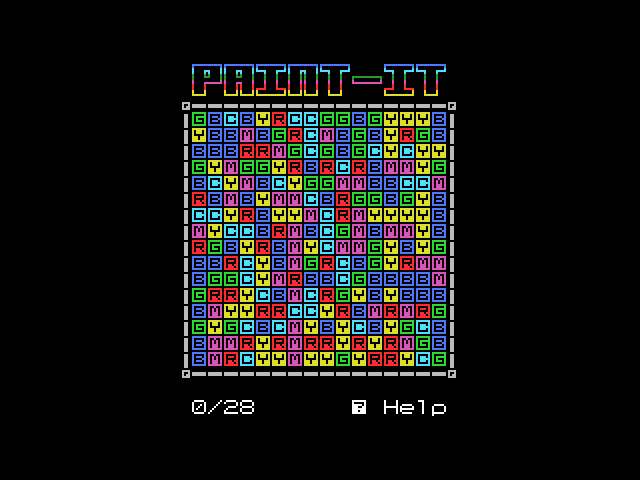
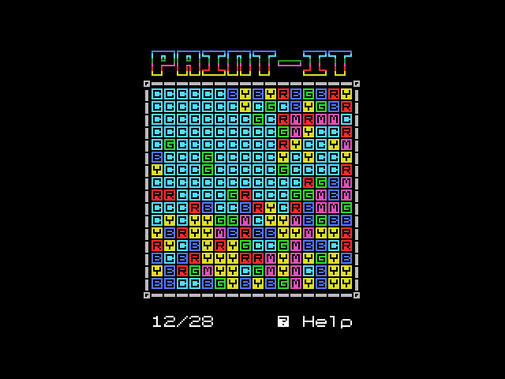
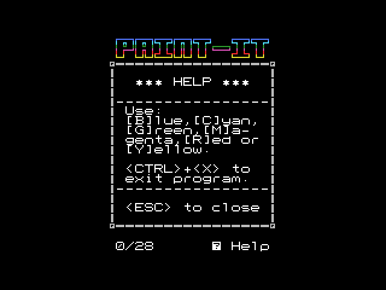
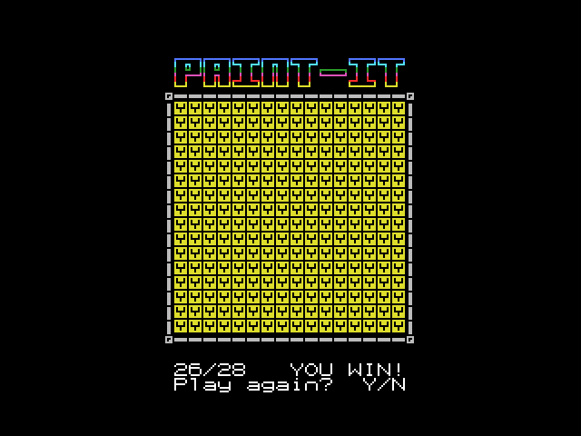

Paint-it for MSX
===

Copyright 2020, Giovanni Nunes

Licensed under [GPL 3.0](LICENSE).

# Introduction

This is a MSX-DOS version for the [Flood-It](https://unixpapa.com/floodit/) game that I've written using [SDCC](http://sdcc.sourceforge.net/).

# About the game

Just fill the board with a single color.

# How to build

Setup the development environment using [Vangrant](https://www.vagrantup.com/):

```shell
vagrant up
```

It will create and setup a virtual machine running **Ubuntu Linux**, with **SDCC** installed and properly configured to generate **MSX-DOS** executables (by Avelino' Herreras' [backend for MSX-DOS](http://msx.avelinoherrera.com/index_en.html#sdccmsxdos)).

When virtual machine ends, simply do:

``` shell
vagrant ssh
cd /vagrant
make
```

A MSX-DOS "COM" named `paint-it.com` will be created. So copy it to a memory card, floppy disk or even to a disk image.

# How to play

You need to fill the board with a single color. Press `SPACE` to generate a new board. Use the following keys to choose a color:

- B for Blue
- C for Cyan
- G for Green
- M for Magenta
- R for Red
- Y for Yellow

Color filling starts from upper left corner and spread to all neighbor blocks with same color. By the way you have only 28 moves to complete this task.

Press `?`  for help!

# Screenshots

#### Initial screen



#### In game playing



#### Help screen



#### You win!




